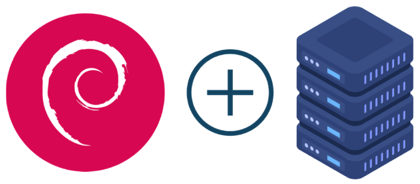

# Debian HomeServer

The project is used to quickly build your own home server by using a simple graphical interface in the console.
Open project. Currently, development works are underway.
Current software installation options:
- Simple user control server website
- File exchange server like [OwnCloud](https://owncloud.org/), FTP or Samba
- Website advertising filter by installing an instance of the [PiHole](https://pi-hole.net/) project as a private DNS server
- [Webmin](http://www.webmin.com/) server management website panel